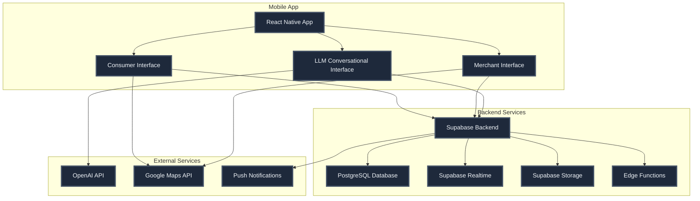
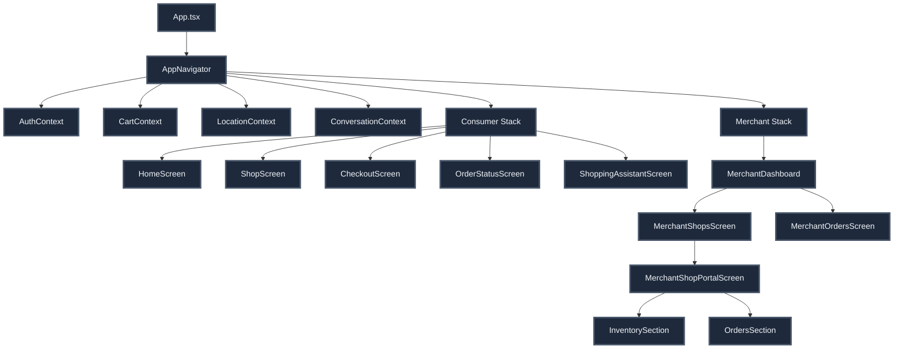
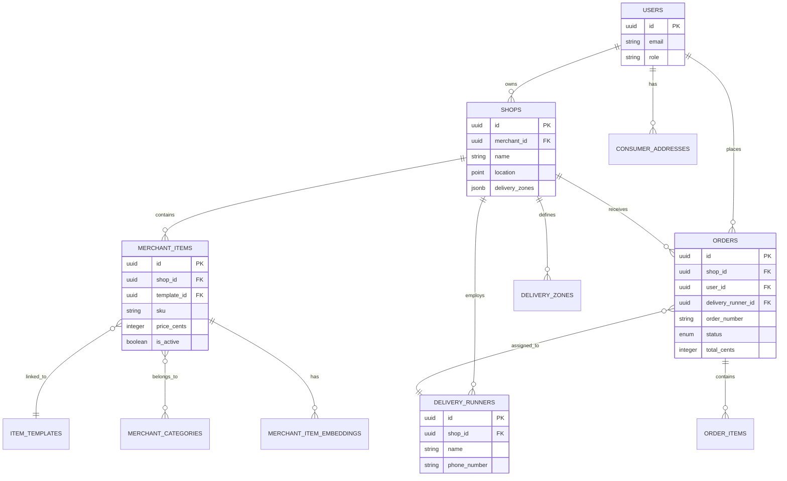
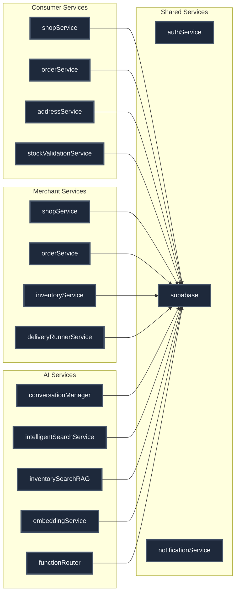
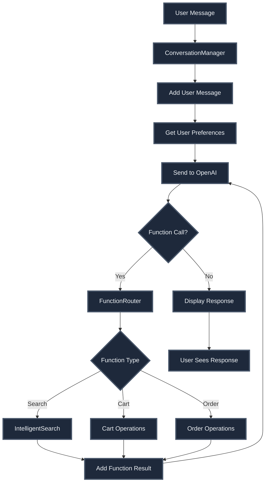
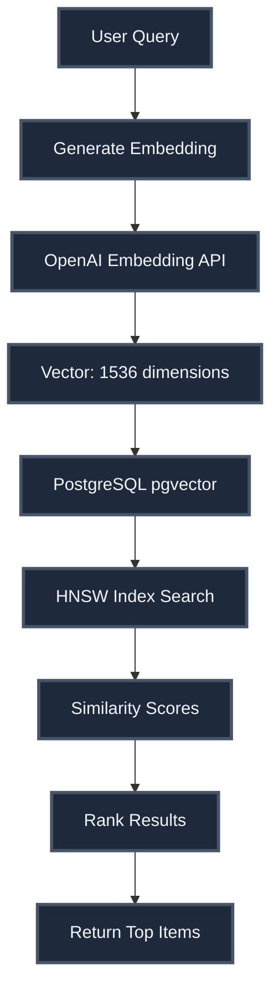
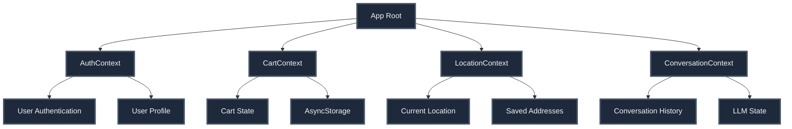
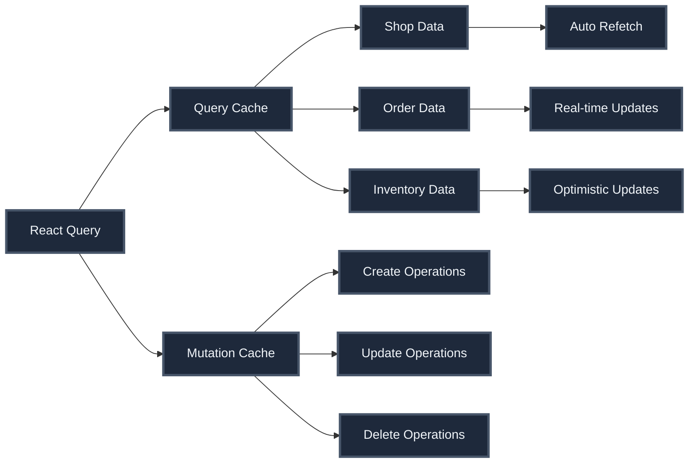
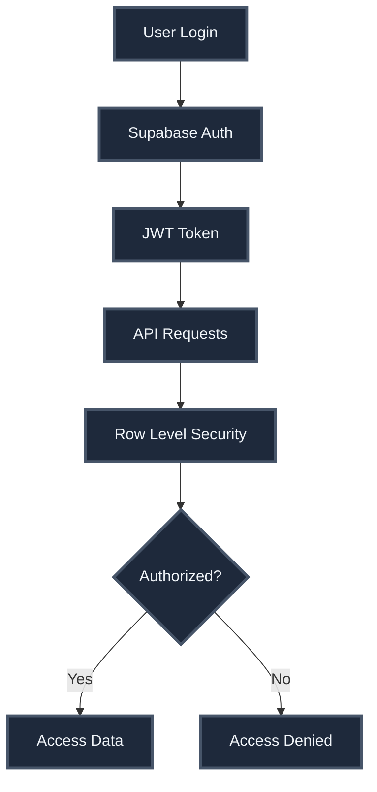

# System Architecture - Complete Documentation

## Overview

AroundYou is a React Native mobile application with a Supabase backend, providing location-based grocery delivery services with conversational AI shopping assistance.

## High-Level Architecture



## Application Architecture

### Component Hierarchy



## Database Architecture

### Core Tables



## Service Layer Architecture

### Service Organization



## Data Flow Architecture

### Order Placement Flow

```mermaid
sequenceDiagram
    participant C as Consumer App
    participant CS as Cart Service
    participant OS as Order Service
    participant DB as Database
    participant RT as Realtime
    participant M as Merchant App
    
    C->>CS: Add items to cart
    CS->>CS: Store in AsyncStorage
    C->>OS: Place order
    OS->>DB: Validate address
    OS->>DB: Calculate totals
    OS->>DB: Create order
    OS->>DB: Create order items
    DB->>RT: Emit order created event
    RT->>M: Notify merchant
    OS->>CS: Clear cart
    OS->>C: Return order confirmation
    
    style C fill:#1e293b,stroke:#475569,stroke-width:3px,color:#f1f5f9
    style CS fill:#1e293b,stroke:#475569,stroke-width:3px,color:#f1f5f9
    style OS fill:#1e293b,stroke:#475569,stroke-width:3px,color:#f1f5f9
    style DB fill:#1e293b,stroke:#475569,stroke-width:3px,color:#f1f5f9
    style RT fill:#1e293b,stroke:#475569,stroke-width:3px,color:#f1f5f9
    style M fill:#1e293b,stroke:#475569,stroke-width:3px,color:#f1f5f9
```

### Real-Time Order Updates

```mermaid
sequenceDiagram
    participant M as Merchant App
    participant DB as Database
    participant RT as Realtime
    participant C as Consumer App
    
    M->>DB: Update order status
    DB->>DB: Trigger status change
    DB->>RT: Emit status update
    RT->>C: Push status change
    RT->>M: Push status change
    C->>C: Update UI
    M->>M: Update UI
    
    style M fill:#1e293b,stroke:#475569,stroke-width:3px,color:#f1f5f9
    style DB fill:#1e293b,stroke:#475569,stroke-width:3px,color:#f1f5f9
    style RT fill:#1e293b,stroke:#475569,stroke-width:3px,color:#f1f5f9
    style C fill:#1e293b,stroke:#475569,stroke-width:3px,color:#f1f5f9
```

## LLM Architecture

### Conversational Flow



### Semantic Search Architecture



## State Management Architecture

### Context Providers



### React Query Integration



## Security Architecture

### Authentication & Authorization



### Row Level Security Policies

- **Consumers:** Can only access their own orders, addresses, and cart data
- **Merchants:** Can only access their own shops, orders, inventory, and runners
- **Shop-scoped:** All merchant data is scoped to shop ownership
- **User-scoped:** All consumer data is scoped to user ownership

## Deployment Architecture

### Mobile App Deployment

- **Platforms:** iOS and Android
- **Build:** React Native with native modules
- **Distribution:** App Store and Google Play Store
- **Updates:** Over-the-air updates via CodePush (future)

### Backend Deployment

- **Hosting:** Supabase Cloud
- **Database:** PostgreSQL on Supabase
- **Storage:** Supabase Storage for images
- **Functions:** Supabase Edge Functions for serverless operations
- **Realtime:** Supabase Realtime for live updates

## Performance Architecture

### Caching Strategy

- **React Query:** Client-side data caching
- **AsyncStorage:** Cart persistence
- **Image Caching:** React Native image caching
- **Embedding Cache:** LLM embedding cache

### Optimization Techniques

- **Vector Search:** HNSW index for fast similarity search
- **Pagination:** Cursor-based pagination for large lists
- **Debouncing:** Search query debouncing
- **Lazy Loading:** Image and component lazy loading
- **Real-time Efficiency:** Targeted subscriptions

## Monitoring & Analytics

### Application Monitoring

- **Error Tracking:** Error boundaries and logging
- **Performance:** React Query devtools
- **Analytics:** Custom analytics events
- **User Behavior:** Event tracking

### Database Monitoring

- **Query Performance:** PostgreSQL query analysis
- **Index Usage:** Index optimization
- **Connection Pooling:** Supabase connection management
- **Realtime Performance:** Subscription monitoring

