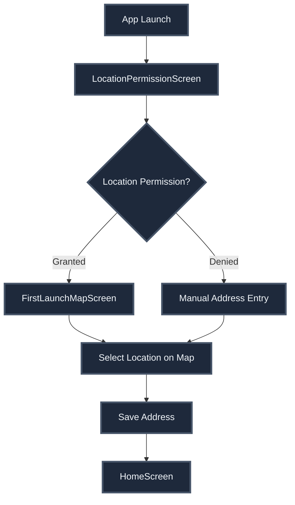
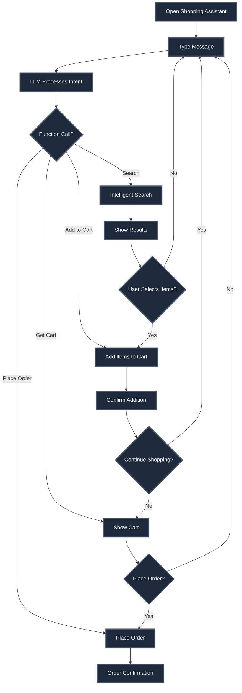

# Consumer System - Complete Documentation

## Overview

The consumer-facing system provides a comprehensive shopping experience with location-based shop discovery, cart management, conversational AI shopping assistant, and real-time order tracking.

## Core Features

### 1. Location & Address Management

**Screens:**
- `LocationPermissionScreen` - Initial location permission request
- `FirstLaunchMapScreen` - Map-based location selection for first launch
- `AddressSearchScreen` - Search and select delivery addresses
- `ConsumerAddressManagementScreen` - Manage saved addresses

**Key Functionality:**
- GPS-based location detection
- Map-based address selection
- Multiple saved addresses support
- Delivery zone validation
- Address snapshots for orders

**Services:**
- `src/services/consumer/addressService.ts` - Address CRUD operations
- `src/hooks/useUserLocation.ts` - Location tracking hook
- `src/hooks/useInitialLocation.ts` - Initial location setup

### 2. Shop Discovery & Browsing

**Screens:**
- `HomeScreen` - Main marketplace with nearby shops
- `SearchScreen` - Global search across shops
- `ShopScreen` - Individual shop browsing
- `CategoryItemsScreen` - Items within a category

**Key Functionality:**
- Location-based shop discovery
- Distance calculation and display
- Shop filtering by type and availability
- Category-based item browsing
- In-shop search functionality
- Real-time shop availability

**Services:**
- `src/services/consumer/shopService.ts` - Shop discovery and details
- `src/hooks/consumer/useShops.ts` - Shop data hooks

### 3. Cart Management

**Screens:**
- `CartsManagementScreen` - View all shop carts
- `ViewCartScreen` - Individual shop cart details
- `CheckoutScreen` - Order placement

**Key Functionality:**
- Per-shop cart management
- Persistent cart storage (AsyncStorage)
- Delivery zone validation
- Cart synchronization
- Quantity management
- Automatic total calculations

**Components:**
- `CartContext` - Global cart state management
- `src/context/CartContext.tsx` - Cart operations

**Data Structure:**
```typescript
{
  [shopId: string]: {
    shopId, shopName, shopImage, shopAddress,
    items: [{ id, name, price_cents, quantity }],
    totalPrice, totalItems
  }
}
```

### 4. Conversational Shopping Assistant

**Screen:**
- `ShoppingAssistantScreen` - LLM-powered conversational interface

**Key Functionality:**
- Natural language item search
- Multi-shop search
- Intent understanding
- Semantic item matching
- Cart management via conversation
- Order placement via conversation

**Components:**
- `ConversationalInterface` - Main UI component
- `ConversationContext` - Conversation state
- `src/services/ai/conversationManager.ts` - LLM interaction

**See LLM.md for complete details**

### 5. Order Management

**Screens:**
- `CheckoutScreen` - Order placement
- `OrderStatusScreen` - Real-time order tracking
- `OrdersListScreen` - Order history

**Key Functionality:**
- Address selection and validation
- Delivery fee calculation
- Payment method selection
- Real-time order status updates
- Order cancellation
- Delivery runner tracking
- Order history with filters

**Components:**
- `ActiveOrderBanner` - Sticky banner for active orders

**Services:**
- `src/services/consumer/orderService.ts` - Order operations
- `src/hooks/consumer/useOrders.ts` - Order hooks

**See ORDERS.md for complete details**

### 6. Profile & Settings

**Screen:**
- `ProfileScreen` - User profile and settings

**Key Functionality:**
- User authentication
- Profile management
- Order history access
- Address management
- Language selection
- Privacy policy
- Account deletion
- Feedback and complaints

## User Flows

### Flow 1: First-Time User Onboarding



### Flow 2: Shopping & Order Placement

```mermaid
flowchart TD
    A[HomeScreen] --> B[Browse Shops]
    B --> C[Select Shop]
    C --> D[ShopScreen]
    D --> E[Browse Categories/Items]
    E --> F[Add Items to Cart]
    F --> G{Cart Actions}
    G -->|Continue Shopping| E
    G -->|View Cart| H[ViewCartScreen]
    H --> I[Review Items]
    I --> J[Proceed to Checkout]
    J --> K[CheckoutScreen]
    K --> L[Select Address]
    L --> M[Select Payment Method]
    M --> N[Review Order]
    N --> O[Place Order]
    O --> P[OrderStatusScreen]
    P --> Q[Track Order]
    Q --> R{Order Status}
    R -->|Delivered| S[Order Complete]
    R -->|Active| Q
    
    style A fill:#1e293b,stroke:#475569,stroke-width:3px,color:#f1f5f9
    style B fill:#1e293b,stroke:#475569,stroke-width:3px,color:#f1f5f9
    style C fill:#1e293b,stroke:#475569,stroke-width:3px,color:#f1f5f9
    style D fill:#1e293b,stroke:#475569,stroke-width:3px,color:#f1f5f9
    style E fill:#1e293b,stroke:#475569,stroke-width:3px,color:#f1f5f9
    style F fill:#1e293b,stroke:#475569,stroke-width:3px,color:#f1f5f9
    style G fill:#1e293b,stroke:#475569,stroke-width:3px,color:#f1f5f9
    style H fill:#1e293b,stroke:#475569,stroke-width:3px,color:#f1f5f9
    style I fill:#1e293b,stroke:#475569,stroke-width:3px,color:#f1f5f9
    style J fill:#1e293b,stroke:#475569,stroke-width:3px,color:#f1f5f9
    style K fill:#1e293b,stroke:#475569,stroke-width:3px,color:#f1f5f9
    style L fill:#1e293b,stroke:#475569,stroke-width:3px,color:#f1f5f9
    style M fill:#1e293b,stroke:#475569,stroke-width:3px,color:#f1f5f9
    style N fill:#1e293b,stroke:#475569,stroke-width:3px,color:#f1f5f9
    style O fill:#1e293b,stroke:#475569,stroke-width:3px,color:#f1f5f9
    style P fill:#1e293b,stroke:#475569,stroke-width:3px,color:#f1f5f9
    style Q fill:#1e293b,stroke:#475569,stroke-width:3px,color:#f1f5f9
    style R fill:#1e293b,stroke:#475569,stroke-width:3px,color:#f1f5f9
    style S fill:#1e293b,stroke:#475569,stroke-width:3px,color:#f1f5f9
```



### Flow 3: Conversational Shopping



## Key Components

### CartContext

**File:** `src/context/CartContext.tsx`

**Responsibilities:**
- Per-shop cart state management
- AsyncStorage persistence
- Cart operations (add, remove, update, delete)
- Total calculations
- Delivery zone validation

**Key Methods:**
- `addItemToCart(shopId, item)` - Add item to cart
- `removeItemFromCart(shopId, itemId)` - Remove item
- `updateItemQuantity(shopId, itemId, quantity)` - Update quantity
- `deleteShopCart(shopId)` - Delete entire cart
- `getShopCart(shopId)` - Get cart for shop
- `getAllCarts()` - Get all carts

### LocationContext

**File:** `src/context/LocationContext.tsx`

**Responsibilities:**
- Current user location tracking
- Address management
- Location permission handling
- Delivery zone validation

### ActiveOrderBanner

**File:** `src/components/consumer/ActiveOrderBanner.tsx`

**Features:**
- Sticky banner above tab bar
- Shows active order status
- Real-time timer
- Progress indicator
- Tap to view order details
- Auto-hides on completion

## Services

### Shop Service

**File:** `src/services/consumer/shopService.ts`

**Key Functions:**
- `findShopsByLocation(lat, lng)` - Find shops near location
- `getShopDetails(shopId)` - Get shop information
- `fetchShopCategories(shopId)` - Get shop categories
- `fetchShopItems(shopId, categoryId?)` - Get shop items
- `validateDeliveryAddress(shopId, lat, lng)` - Validate delivery zone
- `validateCartOrderValue(shopId, value)` - Validate minimum order

### Order Service

**File:** `src/services/consumer/orderService.ts`

**Key Functions:**
- `placeOrder(request)` - Create new order
- `getUserOrders()` - Get user's order history
- `getOrderById(orderId)` - Get order details
- `getActiveOrder()` - Get current active order
- `calculateOrderTotals(shopId, items, addressId)` - Calculate totals
- `cancelOrder(orderId, reason)` - Cancel order

### Address Service

**File:** `src/services/consumer/addressService.ts`

**Key Functions:**
- `createAddress(address)` - Create new address
- `updateAddress(addressId, updates)` - Update address
- `deleteAddress(addressId)` - Delete address
- `getUserAddresses()` - Get all user addresses
- `setDefaultAddress(addressId)` - Set default address

## Hooks

### useOrders

**File:** `src/hooks/consumer/useOrders.ts`

**Hooks:**
- `useUserOrders()` - Get all user orders
- `useOrder(orderId)` - Get specific order
- `useActiveOrder()` - Get active order
- `usePlaceOrder()` - Place order mutation
- `useCancelOrder()` - Cancel order mutation
- `useOrderTimer(orderId)` - Order timer hook
- `useHasActiveOrder()` - Check for active order

### useShops

**File:** `src/hooks/consumer/useShops.ts`

**Hooks:**
- `useShopsByLocation(lat, lng)` - Get shops by location
- `useShopDetails(shopId)` - Get shop details
- `useShopCategories(shopId)` - Get shop categories
- `useShopItems(shopId, categoryId?)` - Get shop items

## Data Models

### ConsumerShop

```typescript
interface ConsumerShop {
  id: string;
  name: string;
  image_url?: string;
  address: string;
  latitude: number;
  longitude: number;
  shop_type: string;
  distanceInMeters?: number;
  deliveryLogic?: DeliveryLogic;
}
```

### ShopItem

```typescript
interface ShopItem {
  id: string;
  name: string;
  description?: string;
  image_url?: string;
  price_cents: number;
  category_ids: string[];
  is_active: boolean;
}
```

### CartItem

```typescript
interface CartItem extends ShopItem {
  quantity: number;
}
```

### Order

```typescript
interface Order {
  id: string;
  order_number: string;
  shop_id: string;
  user_id: string;
  status: 'pending' | 'confirmed' | 'out_for_delivery' | 'delivered' | 'cancelled';
  subtotal_cents: number;
  delivery_fee_cents: number;
  total_cents: number;
  payment_method: 'cash' | 'card' | 'wallet';
  placed_at: string;
  // ... more fields
}
```

## Real-Time Features

### Order Status Updates

- Supabase Realtime subscriptions
- Automatic status change notifications
- Live timer updates
- Delivery runner assignment notifications

### Shop Availability

- Real-time shop status updates
- Delivery zone changes
- Item availability updates

## Edge Cases Handled

1. **Location Permission Denied** - Manual address entry fallback
2. **Delivery Zone Validation** - Prevents ordering from unavailable shops
3. **Cart Persistence** - Survives app restarts
4. **Multiple Shop Carts** - Separate carts per shop
5. **Order Minimum Value** - Validation before checkout
6. **Address Validation** - Ensures address is in delivery zone
7. **Stock Validation** - Checks item availability before cart operations
8. **Network Failures** - Graceful error handling and retry logic
9. **Concurrent Orders** - Prevents multiple simultaneous orders
10. **Order Cancellation** - Time-based cancellation rules

## Performance Optimizations

1. **Location Caching** - Caches user location to reduce API calls
2. **Shop List Caching** - React Query caching for shop lists
3. **Image Optimization** - Lazy loading and caching
4. **Cart Persistence** - AsyncStorage for offline cart access
5. **Real-Time Efficiency** - Targeted subscriptions per order/shop
6. **Search Optimization** - Debounced search queries

## Security

1. **Row Level Security** - Users can only access their own data
2. **Address Validation** - Server-side delivery zone checks
3. **Order Validation** - Server-side order value and item validation
4. **Authentication Required** - Protected routes require login
5. **Data Snapshots** - Order data snapshots prevent retroactive changes

