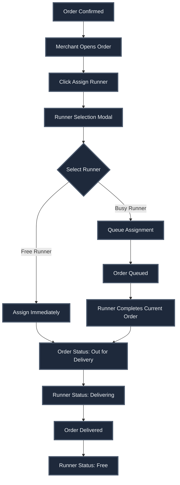
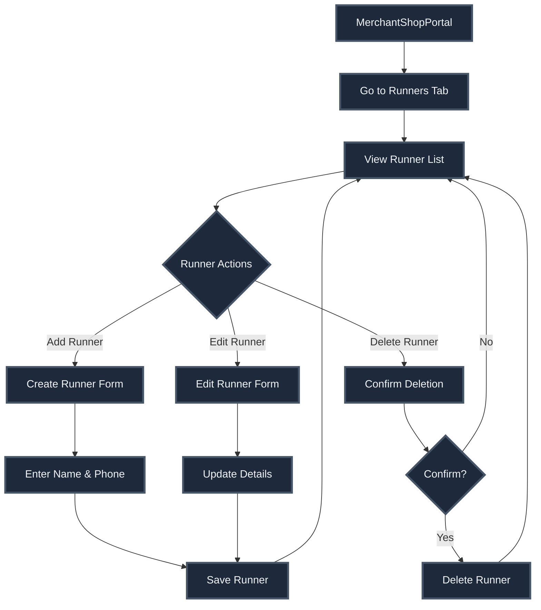

# Delivery System - Complete Documentation

## Overview

The delivery system manages delivery runners, their assignment to orders, availability tracking, and delivery zone management for merchant shops.

## Core Components

### 1. Delivery Runners

**Database Table:** `delivery_runners`

**Schema:**
```sql
CREATE TABLE delivery_runners (
  id UUID PRIMARY KEY,
  shop_id UUID REFERENCES shops(id),
  name TEXT NOT NULL,
  phone_number TEXT NOT NULL,
  created_at TIMESTAMPTZ,
  updated_at TIMESTAMPTZ
);
```

**Key Features:**
- Shop-scoped runners (each runner belongs to one shop)
- Name and phone number tracking
- Multiple runners per shop support
- Real-time availability status

### 2. Runner Assignment

**Process:**
1. Order is confirmed by merchant
2. Merchant selects delivery runner
3. Runner is assigned to order
4. Order status changes to `out_for_delivery`
5. Runner status updates to "delivering"
6. Order is marked as delivered
7. Runner status returns to "free"

**Assignment Rules:**
- Can assign to free runner (immediate assignment)
- Can assign to busy runner (queued assignment)
- Runner can handle multiple orders (queued)
- Real-time status updates

### 3. Runner Status Tracking

**Status Types:**
- **Free** - Available for new assignments
- **Delivering** - Currently delivering an order
- **Queued** - Has orders in queue

**Status Calculation:**
```typescript
interface DeliveryRunnerWithStatus extends DeliveryRunner {
  status: 'free' | 'delivering';
  current_order_id?: string;
  current_order_number?: string;
  queued_orders_count?: number;
}
```

**Real-Time Updates:**
- Polls every 10 seconds for runner status
- Updates when orders change status
- Immediate feedback on assignment

### 4. Delivery Zones

**Management:**
- Polygon-based delivery areas
- Multiple zones per shop
- PostGIS-based validation
- Map-based editing interface

**Validation:**
- Consumer address must be within zone
- Real-time validation on order placement
- Distance calculation for delivery fees

## User Flows

### Flow 1: Runner Assignment



### Flow 2: Runner Management



## Services

### Delivery Runner Service

**File:** `src/services/merchant/deliveryRunnerService.ts`

**Key Functions:**

```typescript
// Get all runners for a shop
fetchDeliveryRunners(shopId: string): Promise<DeliveryRunner[]>

// Create new runner
createDeliveryRunner(
  shopId: string,
  payload: { name: string; phoneNumber: string }
): Promise<DeliveryRunner>

// Update runner details
updateDeliveryRunner(
  runnerId: string,
  payload: { name: string; phoneNumber: string }
): Promise<DeliveryRunner>

// Delete runner
deleteDeliveryRunner(runnerId: string): Promise<void>
```

### Order Service (Runner Assignment)

**File:** `src/services/merchant/orderService.ts`

**Key Functions:**

```typescript
// Get runners with current status
getDeliveryRunnersWithStatus(
  shopId: string
): Promise<DeliveryRunnerWithStatus[]>

// Assign runner and dispatch order
assignRunnerAndDispatch(
  orderId: string,
  runnerId: string
): Promise<{ success: boolean }>
```

## Hooks

### useDeliveryRunners

**File:** `src/hooks/merchant/useDeliveryRunners.ts`

**Hooks:**

```typescript
// Get all runners for shop
useDeliveryRunners(shopId: string)

// Create runner mutation
useCreateDeliveryRunner(shopId: string)

// Update runner mutation
useUpdateDeliveryRunner()

// Delete runner mutation
useDeleteDeliveryRunner()
```

### useOrders (Runner Assignment)

**File:** `src/hooks/merchant/useOrders.ts`

**Hooks:**

```typescript
// Assign runner mutation
useAssignRunnerAndDispatch()
```

## Components

### Runner Assignment Modal

**Location:** Within `OrdersSection` component

**Features:**
- Lists all shop runners
- Shows runner availability status
- Displays current order (if delivering)
- Shows queued orders count
- Allows assignment to free or busy runners
- Real-time status updates

**UI Elements:**
- Runner name and phone
- Status indicator (✓ Free / 🚚 Delivering)
- Current order number (if delivering)
- Assign button

### Runner Management UI

**Location:** Within `MerchantShopPortalScreen`

**Features:**
- List of all runners
- Create new runner form
- Edit runner details
- Delete runner (with confirmation)
- Real-time status display

## Database Schema

### delivery_runners Table

```sql
CREATE TABLE delivery_runners (
  id UUID PRIMARY KEY DEFAULT uuid_generate_v4(),
  shop_id UUID NOT NULL REFERENCES shops(id) ON DELETE CASCADE,
  name TEXT NOT NULL,
  phone_number TEXT NOT NULL,
  created_at TIMESTAMPTZ NOT NULL DEFAULT now(),
  updated_at TIMESTAMPTZ NOT NULL DEFAULT now()
);

CREATE INDEX delivery_runners_shop_id_idx ON delivery_runners(shop_id);
```

### orders Table (Runner Reference)

```sql
ALTER TABLE orders ADD COLUMN delivery_runner_id UUID 
  REFERENCES delivery_runners(id);
```

## Runner Status Calculation

**Query Logic:**

```sql
SELECT 
  dr.*,
  CASE 
    WHEN EXISTS (
      SELECT 1 FROM orders 
      WHERE delivery_runner_id = dr.id 
      AND status = 'out_for_delivery'
    ) THEN 'delivering'
    ELSE 'free'
  END as status,
  (
    SELECT order_number FROM orders 
    WHERE delivery_runner_id = dr.id 
    AND status = 'out_for_delivery'
    LIMIT 1
  ) as current_order_number
FROM delivery_runners dr
WHERE dr.shop_id = $1;
```

## Real-Time Updates

### Status Polling

- Polls every 10 seconds for runner availability
- Updates when orders change status
- Immediate feedback on assignment

### Order Status Changes

- When order moves to `out_for_delivery`: Runner status → "delivering"
- When order moves to `delivered`: Runner status → "free"
- When order is cancelled: Runner status → "free" (if no other orders)

## Edge Cases Handled

1. **Runner Deletion** - Handles orders assigned to deleted runner
2. **Multiple Orders** - Supports queued assignments
3. **Order Cancellation** - Releases runner immediately
4. **Concurrent Assignments** - Database-level locking
5. **Runner Availability** - Real-time status calculation
6. **Status Updates** - Handles race conditions
7. **Phone Number Validation** - Format validation
8. **Shop Ownership** - RLS policies ensure shop-scoped access

## Security

1. **Row Level Security** - Merchants can only access their shop runners
2. **Shop Ownership** - Runner assignment validates shop ownership
3. **Order Ownership** - Can only assign runners to own shop orders
4. **Data Isolation** - Shop-scoped queries

## Performance Optimizations

1. **Status Caching** - Caches runner status for 10 seconds
2. **Efficient Queries** - Optimized status calculation queries
3. **Indexed Lookups** - Indexes on shop_id and delivery_runner_id
4. **Batch Updates** - Efficient status updates
5. **Real-Time Efficiency** - Targeted subscriptions

## Integration Points

### With Orders System

- Runner assignment triggers order status change
- Order completion releases runner
- Order cancellation releases runner

### With Merchant Portal

- Runner management UI in shop portal
- Runner selection in order management
- Status display in order cards

### With Consumer App

- Runner information shown in order status
- Runner phone number for contact
- Delivery tracking information

## Future Enhancements

1. **Runner App** - Dedicated app for delivery runners
2. **Live Tracking** - GPS-based runner location tracking
3. **Route Optimization** - Optimal order assignment
4. **Performance Metrics** - Runner performance tracking
5. **Availability Scheduling** - Runner availability windows
6. **Earnings Tracking** - Per-runner earnings calculation
7. **Rating System** - Consumer ratings for runners

