# Design Patterns & UI/UX - Complete Documentation

## Design System Overview

AroundYou uses a modern, clean design system with consistent colors, typography, spacing, and component patterns across both consumer and merchant interfaces.

## Color Palette

### Primary Colors

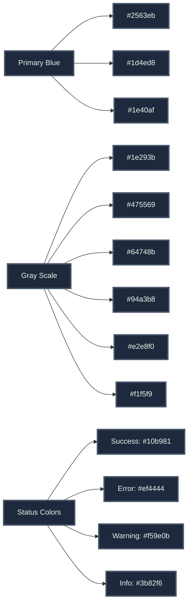

## Component Patterns

### Card Components

```mermaid
graph TD
    A[Card Component] --> B[ShopCard]
    A --> C[ProductCard]
    A --> D[OrderCard]
    A --> E[CategoryCard]
    
    B --> F[Shop Image]
    B --> G[Shop Name]
    B --> H[Distance]
    B --> I[Shop Type]
    
    C --> J[Product Image]
    C --> K[Product Name]
    C --> L[Price]
    C --> M[Add to Cart Button]
    
    D --> N[Order Number]
    D --> O[Status Badge]
    D --> P[Items List]
    D --> Q[Total Price]
    
    style A fill:#1e293b,stroke:#475569,stroke-width:3px,color:#f1f5f9
    style B fill:#1e293b,stroke:#475569,stroke-width:3px,color:#f1f5f9
    style C fill:#1e293b,stroke:#475569,stroke-width:3px,color:#f1f5f9
    style D fill:#1e293b,stroke:#475569,stroke-width:3px,color:#f1f5f9
    style E fill:#1e293b,stroke:#475569,stroke-width:3px,color:#f1f5f9
    style F fill:#1e293b,stroke:#475569,stroke-width:3px,color:#f1f5f9
    style G fill:#1e293b,stroke:#475569,stroke-width:3px,color:#f1f5f9
    style H fill:#1e293b,stroke:#475569,stroke-width:3px,color:#f1f5f9
    style I fill:#1e293b,stroke:#475569,stroke-width:3px,color:#f1f5f9
    style J fill:#1e293b,stroke:#475569,stroke-width:3px,color:#f1f5f9
    style K fill:#1e293b,stroke:#475569,stroke-width:3px,color:#f1f5f9
    style L fill:#1e293b,stroke:#475569,stroke-width:3px,color:#f1f5f9
    style M fill:#1e293b,stroke:#475569,stroke-width:3px,color:#f1f5f9
    style N fill:#1e293b,stroke:#475569,stroke-width:3px,color:#f1f5f9
    style O fill:#1e293b,stroke:#475569,stroke-width:3px,color:#f1f5f9
    style P fill:#1e293b,stroke:#475569,stroke-width:3px,color:#f1f5f9
    style Q fill:#1e293b,stroke:#475569,stroke-width:3px,color:#f1f5f9
```

### Button Patterns

```mermaid
graph TD
    A[Button Component] --> B[Primary Button]
    A --> C[Secondary Button]
    A --> D[Text Button]
    A --> E[Icon Button]
    
    B --> F[Blue Background]
    B --> G[White Text]
    B --> H[Full Width]
    
    C --> I[White Background]
    C --> J[Blue Border]
    C --> K[Blue Text]
    
    D --> L[Transparent]
    D --> M[Blue Text]
    D --> N[Underline on Press]
    
    E --> O[Circular]
    E --> P[Icon Only]
    E --> Q[Touch Feedback]
    
    style A fill:#1e293b,stroke:#475569,stroke-width:3px,color:#f1f5f9
    style B fill:#1e293b,stroke:#475569,stroke-width:3px,color:#f1f5f9
    style C fill:#1e293b,stroke:#475569,stroke-width:3px,color:#f1f5f9
    style D fill:#1e293b,stroke:#475569,stroke-width:3px,color:#f1f5f9
    style E fill:#1e293b,stroke:#475569,stroke-width:3px,color:#f1f5f9
    style F fill:#1e293b,stroke:#475569,stroke-width:3px,color:#f1f5f9
    style G fill:#1e293b,stroke:#475569,stroke-width:3px,color:#f1f5f9
    style H fill:#1e293b,stroke:#475569,stroke-width:3px,color:#f1f5f9
    style I fill:#1e293b,stroke:#475569,stroke-width:3px,color:#f1f5f9
    style J fill:#1e293b,stroke:#475569,stroke-width:3px,color:#f1f5f9
    style K fill:#1e293b,stroke:#475569,stroke-width:3px,color:#f1f5f9
    style L fill:#1e293b,stroke:#475569,stroke-width:3px,color:#f1f5f9
    style M fill:#1e293b,stroke:#475569,stroke-width:3px,color:#f1f5f9
    style N fill:#1e293b,stroke:#475569,stroke-width:3px,color:#f1f5f9
    style O fill:#1e293b,stroke:#475569,stroke-width:3px,color:#f1f5f9
    style P fill:#1e293b,stroke:#475569,stroke-width:3px,color:#f1f5f9
    style Q fill:#1e293b,stroke:#475569,stroke-width:3px,color:#f1f5f9
```

## UI/UX Patterns

### Navigation Patterns

```mermaid
graph TD
    A[App Navigation] --> B[Consumer Navigation]
    A --> C[Merchant Navigation]
    
    B --> D[Bottom Tabs]
    D --> E[Home]
    D --> F[Search]
    D --> G[Carts]
    D --> H[Profile]
    
    B --> I[Stack Navigation]
    I --> J[Shop Details]
    I --> K[Checkout]
    I --> L[Order Status]
    
    C --> M[Bottom Tabs]
    M --> N[Shops]
    M --> O[Orders]
    M --> P[Profile]
    
    C --> Q[Stack Navigation]
    Q --> R[Shop Portal]
    Q --> S[Order Details]
    Q --> T[Inventory]
    
    style A fill:#1e293b,stroke:#475569,stroke-width:3px,color:#f1f5f9
    style B fill:#1e293b,stroke:#475569,stroke-width:3px,color:#f1f5f9
    style C fill:#1e293b,stroke:#475569,stroke-width:3px,color:#f1f5f9
    style D fill:#1e293b,stroke:#475569,stroke-width:3px,color:#f1f5f9
    style E fill:#1e293b,stroke:#475569,stroke-width:3px,color:#f1f5f9
    style F fill:#1e293b,stroke:#475569,stroke-width:3px,color:#f1f5f9
    style G fill:#1e293b,stroke:#475569,stroke-width:3px,color:#f1f5f9
    style H fill:#1e293b,stroke:#475569,stroke-width:3px,color:#f1f5f9
    style I fill:#1e293b,stroke:#475569,stroke-width:3px,color:#f1f5f9
    style J fill:#1e293b,stroke:#475569,stroke-width:3px,color:#f1f5f9
    style K fill:#1e293b,stroke:#475569,stroke-width:3px,color:#f1f5f9
    style L fill:#1e293b,stroke:#475569,stroke-width:3px,color:#f1f5f9
    style M fill:#1e293b,stroke:#475569,stroke-width:3px,color:#f1f5f9
    style N fill:#1e293b,stroke:#475569,stroke-width:3px,color:#f1f5f9
    style O fill:#1e293b,stroke:#475569,stroke-width:3px,color:#f1f5f9
    style P fill:#1e293b,stroke:#475569,stroke-width:3px,color:#f1f5f9
    style Q fill:#1e293b,stroke:#475569,stroke-width:3px,color:#f1f5f9
    style R fill:#1e293b,stroke:#475569,stroke-width:3px,color:#f1f5f9
    style S fill:#1e293b,stroke:#475569,stroke-width:3px,color:#f1f5f9
    style T fill:#1e293b,stroke:#475569,stroke-width:3px,color:#f1f5f9
```

### Screen Layout Patterns

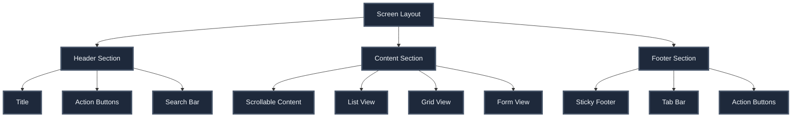

## Consumer UI Patterns

### Home Screen Layout

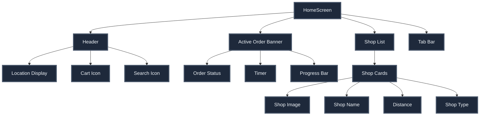

### Shop Screen Layout

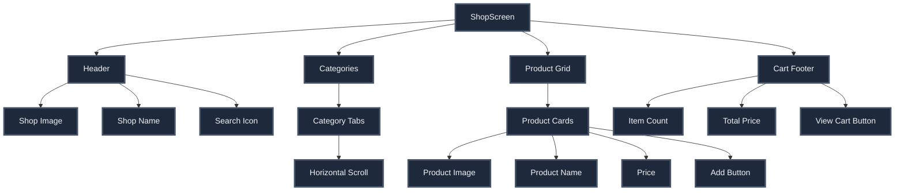

## Merchant UI Patterns

### Merchant Dashboard Layout

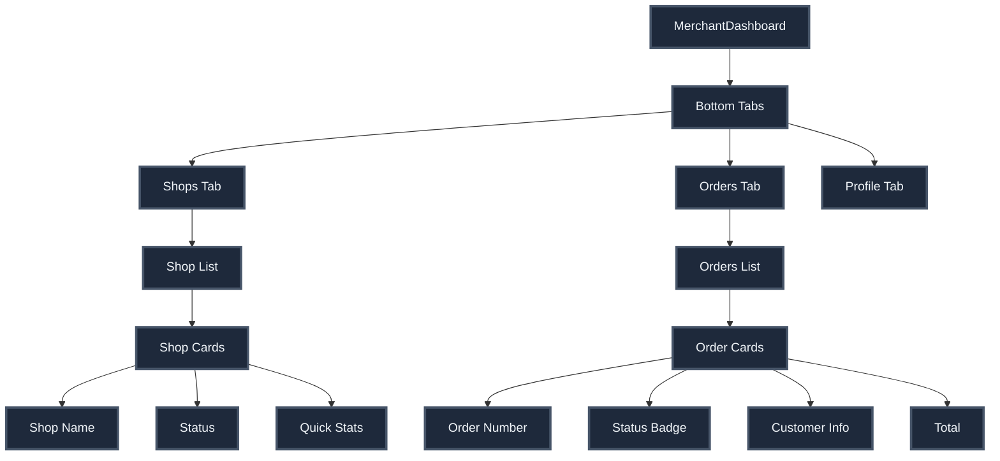

### Shop Portal Layout

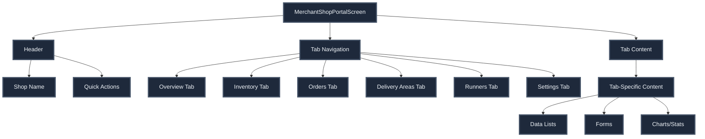

## Interaction Patterns

### Loading States

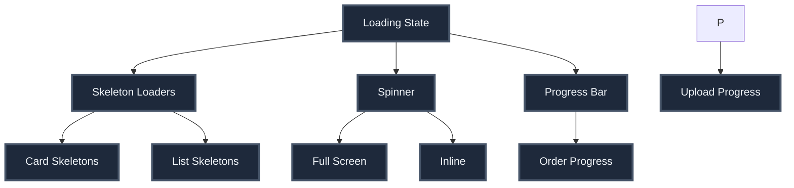

### Error States

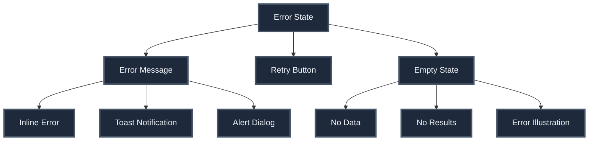

## Animation Patterns

### Transitions

- **Screen Transitions:** Slide from right (iOS), fade (Android)
- **Modal Presentations:** Slide from bottom
- **Tab Switches:** Fade transition
- **List Updates:** Smooth insertions/removals

### Micro-Interactions

- **Button Press:** Scale down animation
- **Cart Updates:** Bounce animation
- **Status Changes:** Pulse animation
- **Loading:** Skeleton shimmer effect
- **Success Actions:** Checkmark animation

## Accessibility

### Design Considerations

- **Color Contrast:** WCAG AA compliant
- **Touch Targets:** Minimum 44x44 points
- **Text Sizes:** Scalable text support
- **Screen Readers:** Proper labels and hints
- **Keyboard Navigation:** Full keyboard support (web)

## Responsive Design

### Breakpoints

- **Mobile:** < 768px (primary)
- **Tablet:** 768px - 1024px (future)
- **Desktop:** > 1024px (future)

### Adaptive Layouts

- **Grid Columns:** Responsive based on screen size
- **Image Sizes:** Optimized for device resolution
- **Font Scaling:** Dynamic based on device settings
- **Spacing:** Consistent across screen sizes

## Design Principles

1. **Clarity:** Clear visual hierarchy and information architecture
2. **Consistency:** Consistent patterns across all screens
3. **Feedback:** Immediate feedback for all user actions
4. **Efficiency:** Minimize steps to complete tasks
5. **Accessibility:** Usable by all users regardless of ability
6. **Performance:** Smooth animations and fast load times
7. **Delight:** Pleasant and engaging user experience

