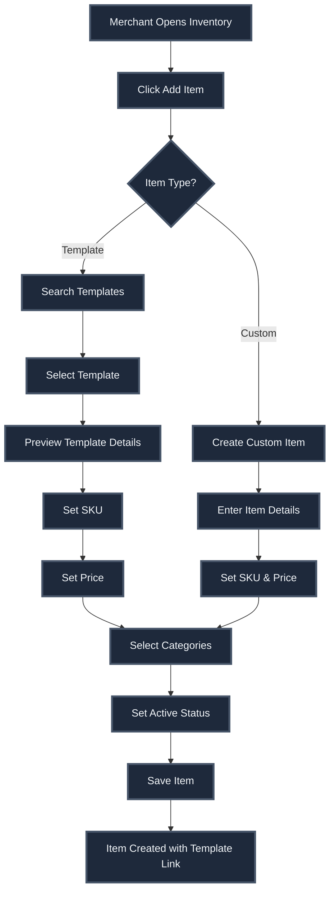
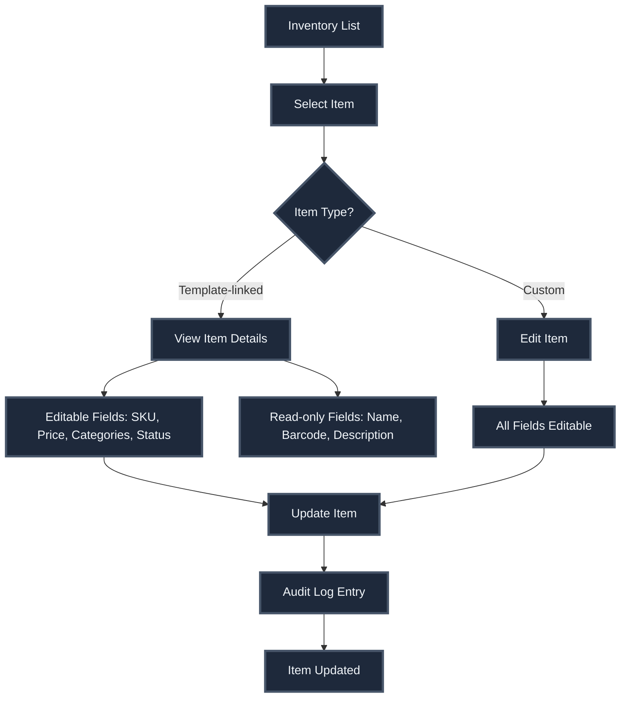

# Inventory Management System - Complete Documentation

## Overview

The inventory management system provides comprehensive item and category management for merchants, supporting both template-based items (from global catalog) and custom items created by merchants.

## Core Concepts

### 1. Template System

**Purpose:** Global catalog of common grocery items that merchants can adopt

**Tables:**
- `item_templates` - Global item catalog
- `category_templates` - Global category catalog

**Benefits:**
- Consistent item naming across shops
- Shared barcode database
- Centralized updates cascade to merchants
- Faster inventory setup

### 2. Merchant Items

**Purpose:** Shop-specific inventory items

**Table:** `merchant_items`

**Types:**
- **Template-linked** - Adopted from global catalog (immutable name/barcode)
- **Custom** - Created by merchant (fully editable)

**Key Fields:**
- `template_id` - Links to item_templates (nullable)
- `is_custom` - Boolean flag for custom items
- `name`, `description`, `image_url` - Item details
- `sku` - Shop-specific SKU (required for active items)
- `price_cents` - Price in smallest currency unit
- `is_active` - Availability status

### 3. Categories

**Purpose:** Organize items within shops

**Table:** `merchant_categories`

**Types:**
- **Template-linked** - Adopted from global categories
- **Custom** - Created by merchant

**Many-to-Many:** Items can belong to multiple categories via `merchant_item_categories`

## Database Schema

### Core Tables

```sql
-- Global templates
CREATE TABLE item_templates (
  id UUID PRIMARY KEY,
  name TEXT NOT NULL,
  barcode TEXT,
  description TEXT,
  image_url TEXT,
  default_unit TEXT,
  created_at TIMESTAMPTZ,
  updated_at TIMESTAMPTZ
);

CREATE TABLE category_templates (
  id UUID PRIMARY KEY,
  name TEXT NOT NULL,
  description TEXT,
  created_at TIMESTAMPTZ,
  updated_at TIMESTAMPTZ
);

-- Merchant-scoped tables
CREATE TABLE merchant_categories (
  id UUID PRIMARY KEY,
  shop_id UUID REFERENCES shops(id),
  template_id UUID REFERENCES category_templates(id),
  name TEXT NOT NULL,
  description TEXT,
  is_custom BOOLEAN DEFAULT TRUE,
  is_active BOOLEAN DEFAULT TRUE,
  created_at TIMESTAMPTZ,
  updated_at TIMESTAMPTZ,
  UNIQUE(shop_id, LOWER(name))
);

CREATE TABLE merchant_items (
  id UUID PRIMARY KEY,
  shop_id UUID REFERENCES shops(id),
  template_id UUID REFERENCES item_templates(id),
  name TEXT,
  description TEXT,
  barcode TEXT,
  image_url TEXT,
  sku TEXT,
  price_cents INTEGER NOT NULL DEFAULT 0,
  currency TEXT DEFAULT 'PKR',
  is_active BOOLEAN DEFAULT TRUE,
  is_custom BOOLEAN DEFAULT TRUE,
  created_at TIMESTAMPTZ,
  updated_at TIMESTAMPTZ,
  created_by UUID,
  last_updated_by JSONB,
  CONSTRAINT chk_active_requires_sku CHECK (
    NOT is_active OR (sku IS NOT NULL AND btrim(sku) <> '')
  ),
  UNIQUE(shop_id, LOWER(sku)) WHERE sku IS NOT NULL
);

-- Many-to-many relationship
CREATE TABLE merchant_item_categories (
  merchant_item_id UUID REFERENCES merchant_items(id),
  merchant_category_id UUID REFERENCES merchant_categories(id),
  sort_order INTEGER DEFAULT 0,
  PRIMARY KEY (merchant_item_id, merchant_category_id)
);

-- Audit logging
CREATE TABLE audit_logs (
  id UUID PRIMARY KEY,
  shop_id UUID REFERENCES shops(id),
  merchant_item_id UUID REFERENCES merchant_items(id),
  actor JSONB NOT NULL,
  action_type TEXT NOT NULL,
  changed_fields JSONB DEFAULT '{}',
  source TEXT DEFAULT 'manual',
  created_at TIMESTAMPTZ
);
```

### Views

**merchant_item_view:**
- Merges template fields with merchant overrides
- Provides unified item representation
- Used by API for reads

**inventory_search:**
- Materialized view for fast search
- Indexes item names and SKUs
- Supports full-text search

## User Flows

### Flow 1: Template Adoption



### Flow 2: Item Management



## Services

### Inventory Service

**File:** `src/services/merchant/inventoryService.ts`

**Key Functions:**

```typescript
// Get items with filters
fetchInventoryItems(
  shopId: string,
  params: {
    search?: string;
    categoryIds?: string[];
    active?: boolean;
    templateFilter?: 'template' | 'custom';
    limit?: number;
    cursor?: string;
  }
): Promise<InventoryListResponse>

// Create item
createInventoryItem(payload: {
  shopId: string;
  templateId?: string;
  name: string;
  description?: string;
  barcode?: string;
  imageUrl?: string;
  sku: string;
  priceCents: number;
  isActive: boolean;
  categoryIds: string[];
}): Promise<InventoryItem>

// Update item
updateInventoryItem(
  itemId: string,
  updates: {
    description?: string;
    sku?: string;
    priceCents?: number;
    isActive?: boolean;
    imageUrl?: string;
    categoryIds?: string[];
  }
): Promise<InventoryItem>

// Delete item
deleteInventoryItem(itemId: string): Promise<void>

// Category operations
fetchInventoryCategories(shopId: string): Promise<InventoryCategory[]>
createInventoryCategory(payload: {...}): Promise<InventoryCategory>
updateInventoryCategory(categoryId: string, updates: {...}): Promise<InventoryCategory>
deleteInventoryCategory(categoryId: string): Promise<void>

// Audit log
fetchAuditLog(
  shopId: string,
  filters: {
    itemId?: string;
    actionType?: string;
    dateFrom?: Date;
    dateTo?: Date;
  }
): Promise<AuditLogEntry[]>
```

## Components

### InventorySection

**File:** `src/screens/merchant/shop/sections/InventorySection.tsx`

**Tabs:**
1. **All Items** - Complete item list with filters
2. **Templates** - Template-based items only
3. **Categories** - Category management
4. **Audit Log** - Change history

**Features:**
- Search and filter items
- Create/edit/delete items
- Category management
- Bulk operations
- Template adoption
- Audit log viewing

### Item Creation Modal

**Features:**
- Template search and selection
- Item details form
- SKU and price input
- Category multi-select
- Active status toggle
- Image upload

### Category Management

**Features:**
- Create/edit/delete categories
- Template category adoption
- Drag-and-drop ordering
- Item count display
- Active/inactive toggle

## Data Models

### InventoryItem

```typescript
interface InventoryItem {
  id: string;
  shopId: string;
  templateId?: string;
  name: string;
  description?: string;
  barcode?: string;
  imageUrl?: string;
  sku: string;
  priceCents: number;
  currency: string;
  isActive: boolean;
  isCustom: boolean;
  categoryIds: string[];
  timesSold: number;
  totalRevenueCents: number;
  createdAt: string;
  updatedAt: string;
  lastUpdatedBy?: {
    id: string;
    name: string;
    role: string;
  };
}
```

### InventoryCategory

```typescript
interface InventoryCategory {
  id: string;
  shopId: string;
  templateId?: string;
  name: string;
  description?: string;
  isCustom: boolean;
  isActive: boolean;
  itemCount?: number;
  createdAt: string;
  updatedAt: string;
}
```

### AuditLogEntry

```typescript
interface AuditLogEntry {
  id: string;
  shopId: string;
  merchantItemId: string;
  actor: {
    id: string;
    name: string;
    role: string;
  };
  actionType: 'CREATE' | 'UPDATE' | 'DELETE';
  changedFields: {
    [field: string]: {
      from: any;
      to: any;
    };
  };
  source: 'manual' | 'bulk_import' | 'template_update';
  createdAt: string;
}
```

## Template System Details

### Template Adoption Process

1. Merchant searches templates
2. Selects template item
3. System creates `merchant_items` row with `template_id`
4. Merchant sets shop-specific fields (SKU, price, categories)
5. Template fields (name, barcode) are read-only

### Template Updates

When admin updates template:
- Changes cascade to all merchant items linked to template
- Audit log entries created with `source = 'template_update'`
- Merchant overrides (SKU, price) remain unchanged

### Custom Items

- `template_id` is null
- `is_custom` is true
- All fields are editable
- Full merchant control

## Audit Logging

### Automatic Tracking

**Triggers:**
- Item creation
- Item updates (field-level diffs)
- Item deletion
- Category changes
- Bulk operations

**Information Captured:**
- Actor (user who made change)
- Action type
- Changed fields (before/after)
- Source (manual, bulk, template)
- Timestamp

### Audit Log Queries

```typescript
// Get audit log for item
fetchAuditLog(shopId, { itemId: 'xxx' })

// Get audit log by date range
fetchAuditLog(shopId, {
  dateFrom: new Date('2024-01-01'),
  dateTo: new Date('2024-12-31')
})

// Get audit log by action type
fetchAuditLog(shopId, { actionType: 'UPDATE' })
```

## Analytics

### Item Analytics

**Tracked Metrics:**
- `times_sold` - Number of times item sold
- `total_revenue_cents` - Total revenue from item

**Updates:**
- Incremented when order is delivered
- Updated atomically in database trigger

### Category Analytics

**Metrics:**
- Item count per category
- Active/inactive item counts
- Category usage statistics

## Edge Cases Handled

1. **Template Deletion** - Prevents deletion if items linked
2. **SKU Uniqueness** - Enforced per shop
3. **Active Item Requirements** - SKU required for active items
4. **Category Deletion** - Handles item reassignment
5. **Concurrent Updates** - Optimistic locking
6. **Template Updates** - Cascade to merchant items
7. **Bulk Operations** - Efficient batch processing
8. **Image Upload** - Handles failures gracefully
9. **Price Validation** - Ensures non-negative prices
10. **Category Assignment** - Validates category ownership

## Security

1. **Row Level Security** - Merchants can only access their shop items
2. **Shop Ownership** - All operations validate shop ownership
3. **Template Protection** - Template fields immutable for merchants
4. **Audit Trail** - Complete change history
5. **Data Isolation** - Shop-scoped queries

## Performance Optimizations

1. **Materialized Views** - Fast search via inventory_search
2. **Indexes** - On shop_id, sku, template_id
3. **Pagination** - Cursor-based pagination for large lists
4. **Caching** - React Query caching for item lists
5. **Lazy Loading** - Images loaded on demand
6. **Debounced Search** - Optimized search queries

## Integration Points

### With Orders System

- Item sales tracking on order delivery
- Revenue calculation per item
- Stock validation (future)

### With Consumer App

- Item display in shop browsing
- Search functionality
- Category-based browsing
- Price display

### With LLM System

- Semantic search via embeddings
- Item matching for conversational interface
- Template-based search

## Future Enhancements

1. **Stock Management** - Physical inventory tracking
2. **Bulk Import** - CSV/Excel import
3. **Barcode Scanning** - Mobile barcode scanner
4. **Price History** - Track price changes over time
5. **Low Stock Alerts** - Reorder notifications
6. **Multi-Unit Support** - Different units (kg, liter, etc.)
7. **Variants** - Size/color variants
8. **Bundles** - Product bundles/packages

