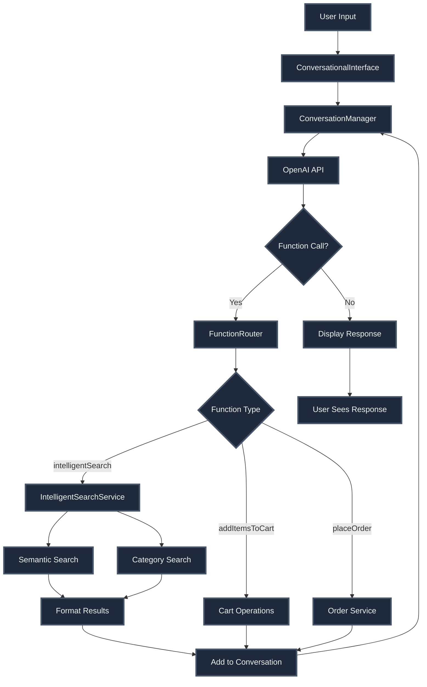
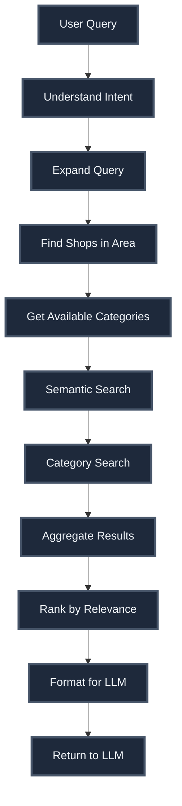
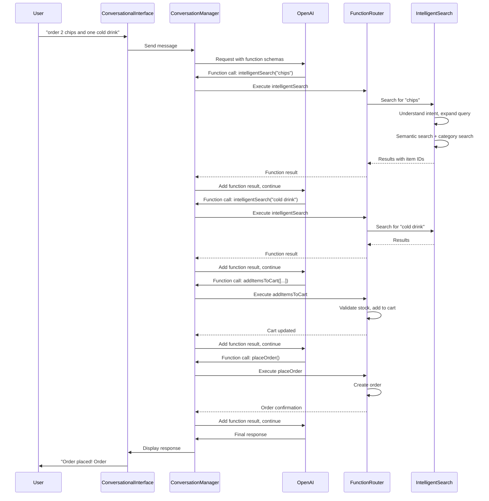

# LLM Conversational Interface - Complete Documentation

## Overview

An intelligent shopping assistant powered by OpenAI's GPT models that enables natural language shopping, multi-shop search, semantic item matching, and conversational order placement.

## Architecture

### High-Level Flow



## Core Components

### 1. ConversationalInterface

**File:** `src/components/conversational/ConversationalInterface.tsx`

**Responsibilities:**
- UI for conversation (message bubbles, input field)
- Orchestrates function call loop
- Handles sequential function calls
- Manages conversation state

**Key Flow:**
1. User sends message
2. Retrieves user preferences for context
3. Sends to conversation manager
4. Loops through function calls until final response
5. Displays response to user

### 2. ConversationManager

**File:** `src/services/ai/conversationManager.ts`

**Responsibilities:**
- Maintains message history (system, user, assistant)
- Formats messages for OpenAI API
- Handles function call detection
- Manages conversation state persistence

**Key Methods:**
- `sendMessage(message)` - Send message to LLM
- `addFunctionResult(functionName, result)` - Add function result
- `getOpenAIMessages()` - Format messages for API

### 3. IntelligentSearchService

**File:** `src/services/ai/intelligentSearchService.ts`

**Responsibilities:**
- Intent understanding from natural language
- Query expansion (brands, categories, synonyms)
- Multi-shop search execution
- Result aggregation and ranking

**Key Functions:**

```typescript
// Understand user intent
understandSearchIntent(query: string): Promise<SearchIntent>

// Intelligent search across shops
intelligentSearch(query: string): Promise<IntelligentSearchResult>
```

**Search Intent Structure:**
```typescript
interface SearchIntent {
  primaryQuery: string;
  expandedQueries: string[];
  categories: string[];
  brands: string[];
  itemTypes: string[];
}
```

### 4. Semantic Search Engine

**File:** `src/services/ai/inventorySearchRAG.ts`

**Technology:**
- Vector embeddings (OpenAI text-embedding-3-small)
- pgvector HNSW index for fast similarity search
- 1536-dimensional embeddings

**Key Functions:**

```typescript
// Search items across shops
searchItemsAcrossShops(
  query: string,
  shopIds: string[]
): Promise<SearchResult[]>

// Search items in single shop
searchItemsInShop(
  shopId: string,
  query: string
): Promise<SearchResult[]>
```

**Database Support:**
- Table: `merchant_item_embeddings`
- Migration: `047_create_inventory_embeddings.sql`
- Function: `search_items_across_shops_by_similarity`

### 5. FunctionRouter

**File:** `src/services/ai/functionRouter.ts`

**Supported Functions:**

1. **intelligentSearch**
   - Multi-shop semantic search
   - Returns shops with matching items

2. **addItemsToCart** (Batch)
   - Adds multiple items to cart
   - Validates stock
   - Returns summary

3. **addItemToCart** (Single)
   - Adds single item to cart

4. **removeItemFromCart**
   - Removes item or reduces quantity

5. **updateItemQuantity**
   - Updates item quantity

6. **getCart**
   - Returns current cart for shop

7. **getAllCarts**
   - Returns all carts across shops

8. **placeOrder**
   - Places order from cart
   - Validates cart and address
   - Returns order confirmation

## Function Schemas

**File:** `src/services/ai/functionSchemas.ts`

**Purpose:** Defines available functions for OpenAI with descriptions and parameter schemas

**Example Schema:**
```typescript
{
  name: "intelligentSearch",
  description: "Search for items across multiple shops using natural language",
  parameters: {
    type: "object",
    properties: {
      query: {
        type: "string",
        description: "Natural language search query"
      }
    },
    required: ["query"]
  }
}
```

## Search Process

### Step-by-Step Search Flow



### Intent Understanding

**Process:**
1. LLM analyzes user query
2. Identifies:
   - Primary search terms
   - Brand names (with variations)
   - Category synonyms
   - Item types
3. Expands query with variations

**Example:**
- Input: "2 chips and one cold drink"
- Output:
  - Primary: "chips", "cold drink"
  - Expanded: ["chips", "Lay's", "snacks", "Munchies category"]
  - Categories: ["Munchies", "Cold Drinks & Juices"]

### Semantic Search

**Process:**
1. Generate embedding for query
2. Search across all shops simultaneously
3. Use pgvector HNSW index
4. Return items with similarity scores (0.0-1.0)
5. Deduplicate (keep highest score)

### Category Search

**Process:**
1. Match category names from intent
2. Fetch items from matching categories
3. Add items with category match score (0.7)
4. Combine with semantic results

### Result Aggregation

**Process:**
1. Combine semantic + category results
2. Group items by shop
3. Calculate relevance scores:
   - Item count
   - Similarity scores
   - Delivery fee
4. Sort by relevance
5. Format for LLM display

## Example Conversation Flow

### "Order 2 chips and one cold drink"



## Supporting Systems

### User Preferences & Memory

**File:** `src/services/ai/memoryRetrievalService.ts`

**Purpose:**
- Retrieves user preferences using vector similarity
- Personalizes search results
- Called before sending message

**Database:**
- Tables: `user_preferences`, `user_preference_embeddings`
- Migration: `046_create_preference_memory_system.sql`
- Function: `search_user_preferences_by_similarity`

### Embedding Generation

**File:** `src/services/ai/embeddingService.ts`

**Purpose:**
- Generates embeddings for queries and items
- Uses OpenAI text-embedding-3-small model
- Supports batch processing
- Caches embeddings

**File:** `src/services/ai/openAIService.ts`
- Low-level OpenAI API client
- Handles chat completions and embeddings

### Stock Validation

**File:** `src/services/consumer/stockValidationService.ts`

**Function:** `validateItemStock(itemId, quantity)`
- Validates item availability before adding to cart
- Called by functionRouter before cart operations

## Database Schema

### Item Embeddings

**Table:** `merchant_item_embeddings`
- Stores 1536-dimensional embeddings
- HNSW index for fast similarity search
- Migration: `047_create_inventory_embeddings.sql`

### User Preferences

**Tables:** `user_preferences`, `user_preference_embeddings`
- Stores user preferences with embeddings
- Migration: `046_create_preference_memory_system.sql`

### Vector Extension

**Migration:** `045_enable_pgvector_extension.sql`
- Enables pgvector extension for vector operations

## Key Design Decisions

1. **Sequential Function Calls** - Loops through function calls until final response
2. **Semantic + Category Search** - Combines vector embeddings with category matching
3. **Intent Expansion** - Uses LLM to expand queries intelligently
4. **Multi-Shop Search** - Searches across all shops simultaneously
5. **Batch Operations** - Supports batch adding items to cart
6. **Context Preservation** - Conversation history maintained for context

## Error Handling

- Function execution errors caught and reported to LLM
- Stock validation failures prevent adding unavailable items
- Search failures fall back to text search
- Embedding generation failures fall back to text search
- Maximum 10 function call iterations to prevent infinite loops

## Performance Considerations

- Vector search uses HNSW index for fast approximate nearest neighbor search
- Batch operations reduce API calls
- Message history managed to prevent context window overflow
- Embeddings cached when possible
- Shop search is location-based (only searches relevant shops)

## Integration Points

### With Cart System
- Adds items to cart via CartContext
- Validates stock before adding
- Updates cart quantities

### With Order System
- Places orders via orderService
- Validates cart and address
- Returns order confirmation

### With Inventory System
- Searches items via semantic search
- Uses item embeddings for matching
- Accesses item details and prices

### With Consumer App
- Conversational interface in ShoppingAssistantScreen
- Natural language shopping experience
- Seamless order placement

