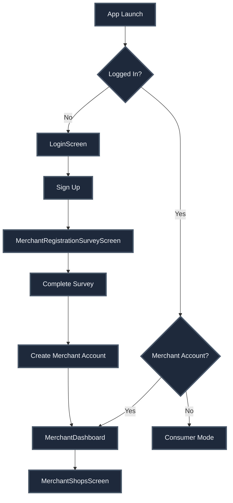
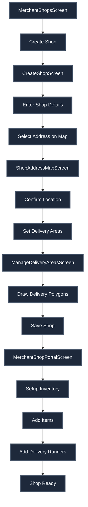
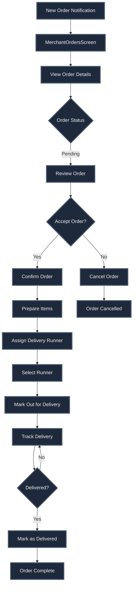

# Merchant System - Complete Documentation

## Overview

The merchant-facing system provides comprehensive shop management, inventory control, order processing, delivery runner management, and analytics for shop owners.

## Core Features

### 1. Merchant Onboarding & Authentication

**Screens:**
- `MerchantRegistrationSurveyScreen` - Initial merchant registration
- `LoginScreen` - Authentication
- `MerchantDashboard` - Main merchant interface

**Key Functionality:**
- Merchant account creation
- Email/Google authentication
- Role-based access control
- Multi-shop support
- Profile management

**Services:**
- `src/services/authService.ts` - Authentication operations
- `src/services/merchant/shopService.ts` - Shop management

### 2. Shop Management

**Screens:**
- `MerchantShopsScreen` - List of merchant's shops
- `CreateShopScreen` - Create new shop
- `EditShopScreen` - Edit shop details
- `ShopAddressMapScreen` - Map-based address selection
- `MerchantShopPortalScreen` - Shop management portal

**Key Functionality:**
- Shop creation and editing
- Shop details management (name, image, address, type)
- Delivery area management (polygon-based zones)
- Shop status management (active/inactive)
- Multiple shop support per merchant

**Components:**
- `ShopForm` - Shop creation/edit form
- `DeliveryAreaEditor` - Polygon-based delivery zone editor

**Services:**
- `src/services/merchant/shopService.ts` - Shop CRUD operations
- `src/hooks/merchant/useShops.ts` - Shop data hooks

### 3. Inventory Management

**Screen:**
- `InventorySection` (within MerchantShopPortalScreen)

**Key Functionality:**
- Item creation and editing
- Template-based item adoption
- Custom item creation
- Category management
- Bulk operations
- Price and SKU management
- Item activation/deactivation
- Audit log tracking

**Components:**
- `InventorySection` - Main inventory interface
- Item creation/edit modals
- Category management UI
- Audit log viewer

**Services:**
- `src/services/merchant/inventoryService.ts` - Inventory operations
- `src/hooks/merchant/useInventoryItems.ts` - Inventory hooks

**See INVENTORY.md for complete details**

### 4. Order Management

**Screens:**
- `MerchantOrdersScreen` - Orders dashboard
- `MerchantOrderScreen` - Individual order details
- `OrdersSection` (within MerchantShopPortalScreen)

**Key Functionality:**
- Real-time order notifications
- Order status management (confirm, dispatch, deliver, cancel)
- Delivery runner assignment
- Order filtering (time-based, status-based)
- Order analytics
- Customer information display
- Delivery address with map integration

**Components:**
- `OrdersSection` - Complete order management UI
- Order cards with status badges
- Runner assignment modal
- Order detail modal

**Services:**
- `src/services/merchant/orderService.ts` - Order operations
- `src/hooks/merchant/useOrders.ts` - Order hooks

**See ORDERS.md for complete details**

### 5. Delivery Runner Management

**Screen:**
- Runner management (within MerchantShopPortalScreen)

**Key Functionality:**
- Create/edit/delete delivery runners
- Runner availability tracking
- Runner assignment to orders
- Runner status monitoring (free/delivering)
- Runner contact information

**Components:**
- Runner list UI
- Runner creation/edit forms
- Runner assignment modal

**Services:**
- `src/services/merchant/deliveryRunnerService.ts` - Runner operations
- `src/hooks/merchant/useDeliveryRunners.ts` - Runner hooks

**See DELIVERY.md for complete details**

### 6. Analytics & Reporting

**Features:**
- Order analytics (total orders, revenue, averages)
- Item sales tracking
- Performance metrics
- Time-based filtering
- Revenue tracking per item

**Data Sources:**
- Order completion analytics
- Item sales counts
- Revenue calculations
- Timing metrics (confirmation, preparation, delivery)

### 7. Profile & Settings

**Screen:**
- `MerchantProfileScreen` - Merchant profile and settings

**Key Functionality:**
- Profile information
- Shop management access
- Settings and preferences
- FAQ and support
- Account management

## User Flows

### Flow 1: Merchant Onboarding



### Flow 2: Shop Creation & Setup



### Flow 3: Order Processing



## Key Components

### MerchantShopPortalScreen

**File:** `src/screens/merchant/shop/MerchantShopPortalScreen.tsx`

**Tabs:**
1. **Overview** - Shop summary and quick stats
2. **Inventory** - Item and category management
3. **Orders** - Order processing and management
4. **Delivery Areas** - Delivery zone management
5. **Runners** - Delivery runner management
6. **Settings** - Shop settings

**Features:**
- Tab-based navigation
- Real-time data updates
- Shop context throughout
- Quick actions

### OrdersSection

**File:** `src/components/merchant/OrdersSection.tsx`

**Features:**
- Time-based filtering (Today, Yesterday, Last 7 Days, etc.)
- Status-based filtering
- Order cards with live timers
- Order detail modal
- Runner assignment UI
- Status action buttons
- Real-time updates

### InventorySection

**File:** `src/screens/merchant/shop/sections/InventorySection.tsx`

**Tabs:**
- **All Items** - Complete item list
- **Templates** - Template-based items
- **Categories** - Category management
- **Audit Log** - Change history

**Features:**
- Item CRUD operations
- Template adoption
- Category management
- Bulk operations
- Search and filters
- Audit trail

## Services

### Shop Service

**File:** `src/services/merchant/shopService.ts`

**Key Functions:**
- `createShop(shopData)` - Create new shop
- `updateShop(shopId, updates)` - Update shop details
- `deleteShop(shopId)` - Delete shop
- `getMerchantShops()` - Get all merchant shops
- `getShopDetails(shopId)` - Get shop information
- `updateDeliveryAreas(shopId, areas)` - Update delivery zones

### Order Service

**File:** `src/services/merchant/orderService.ts`

**Key Functions:**
- `getShopOrders(shopId)` - Get all shop orders
- `getFilteredShopOrders(shopId, filters)` - Get filtered orders
- `confirmOrder(orderId)` - Confirm order
- `assignRunnerAndDispatch(orderId, runnerId)` - Assign runner
- `markOrderDelivered(orderId)` - Mark as delivered
- `cancelOrder(orderId, reason)` - Cancel order
- `getDeliveryRunnersWithStatus(shopId)` - Get runners with status
- `getShopOrderAnalytics(shopId, period)` - Get analytics

### Inventory Service

**File:** `src/services/merchant/inventoryService.ts`

**Key Functions:**
- `fetchInventoryItems(shopId, params)` - Get items
- `createInventoryItem(payload)` - Create item
- `updateInventoryItem(itemId, updates)` - Update item
- `deleteInventoryItem(itemId)` - Delete item
- `fetchInventoryCategories(shopId)` - Get categories
- `createInventoryCategory(payload)` - Create category
- `updateInventoryCategory(categoryId, updates)` - Update category
- `fetchAuditLog(shopId, filters)` - Get audit log

### Delivery Runner Service

**File:** `src/services/merchant/deliveryRunnerService.ts`

**Key Functions:**
- `fetchDeliveryRunners(shopId)` - Get all runners
- `createDeliveryRunner(shopId, payload)` - Create runner
- `updateDeliveryRunner(runnerId, payload)` - Update runner
- `deleteDeliveryRunner(runnerId)` - Delete runner

## Hooks

### useShops

**File:** `src/hooks/merchant/useShops.ts`

**Hooks:**
- `useMerchantShops()` - Get all merchant shops
- `useShopDetails(shopId)` - Get shop details
- `useCreateShop()` - Create shop mutation
- `useUpdateShop()` - Update shop mutation
- `useDeleteShop()` - Delete shop mutation

### useOrders

**File:** `src/hooks/merchant/useOrders.ts`

**Hooks:**
- `useShopOrders(shopId)` - Get shop orders
- `useFilteredShopOrders(shopId, filters)` - Get filtered orders
- `useConfirmOrder()` - Confirm order mutation
- `useAssignRunnerAndDispatch()` - Assign runner mutation
- `useMarkOrderDelivered()` - Mark delivered mutation
- `useCancelOrder()` - Cancel order mutation
- `useShopOrderAnalytics(shopId, period)` - Get analytics

### useInventoryItems

**File:** `src/hooks/merchant/useInventoryItems.ts`

**Hooks:**
- `useInventoryItems(shopId, params)` - Get items
- `useCreateInventoryItem(shopId)` - Create item mutation
- `useUpdateInventoryItem()` - Update item mutation
- `useDeleteInventoryItem()` - Delete item mutation
- `useInventoryCategories(shopId)` - Get categories

### useDeliveryRunners

**File:** `src/hooks/merchant/useDeliveryRunners.ts`

**Hooks:**
- `useDeliveryRunners(shopId)` - Get runners
- `useCreateDeliveryRunner(shopId)` - Create runner mutation
- `useUpdateDeliveryRunner()` - Update runner mutation
- `useDeleteDeliveryRunner()` - Delete runner mutation

## Data Models

### MerchantShop

```typescript
interface MerchantShop {
  id: string;
  merchant_id: string;
  name: string;
  image_url?: string;
  address: string;
  latitude: number;
  longitude: number;
  shop_type: string;
  is_active: boolean;
  created_at: string;
  updated_at: string;
}
```

### DeliveryLogic

```typescript
interface DeliveryLogic {
  shop_id: string;
  least_order_value: number;
  free_delivery_threshold: number;
  delivery_fee_per_km: number;
  max_delivery_distance_km: number;
  delivery_zones: Polygon[];
}
```

### InventoryItem

```typescript
interface InventoryItem {
  id: string;
  shop_id: string;
  template_id?: string;
  name: string;
  description?: string;
  image_url?: string;
  sku: string;
  price_cents: number;
  is_active: boolean;
  is_custom: boolean;
  category_ids: string[];
  times_sold: number;
  total_revenue_cents: number;
}
```

### DeliveryRunner

```typescript
interface DeliveryRunner {
  id: string;
  shop_id: string;
  name: string;
  phone_number: string;
  created_at: string;
  updated_at: string;
}
```

## Real-Time Features

### Order Notifications

- Real-time new order alerts
- Status change notifications
- Runner assignment updates
- Order completion notifications

### Inventory Updates

- Real-time item availability
- Price change notifications
- Stock updates

## Analytics & Reporting

### Order Analytics

**Metrics:**
- Total orders (period-based)
- Total revenue
- Average order value
- Average confirmation time
- Average preparation time
- Average delivery time
- Status breakdown

### Item Analytics

**Metrics:**
- Times sold per item
- Total revenue per item
- Best selling items
- Category performance

## Edge Cases Handled

1. **Multiple Shops** - Separate management per shop
2. **Order Race Conditions** - Database-level locking
3. **Runner Availability** - Real-time status tracking
4. **Delivery Zone Validation** - Polygon-based checks
5. **Inventory Conflicts** - Optimistic locking
6. **Template Updates** - Cascade to merchant items
7. **Order Cancellation** - Time-based rules
8. **Runner Assignment** - Queue support for busy runners
9. **Concurrent Updates** - Transaction-based operations
10. **Data Integrity** - Foreign key constraints and RLS

## Security

1. **Row Level Security** - Merchants can only access their shops
2. **Shop Ownership Validation** - Server-side checks
3. **Order Access Control** - Shop-based filtering
4. **Inventory Protection** - Shop-scoped operations
5. **Runner Management** - Shop ownership required

## Performance Optimizations

1. **Order Filtering** - Efficient database queries
2. **Real-Time Subscriptions** - Targeted channels
3. **Inventory Caching** - React Query caching
4. **Image Optimization** - Lazy loading
5. **Pagination** - Large list handling
6. **Debounced Search** - Search query optimization

