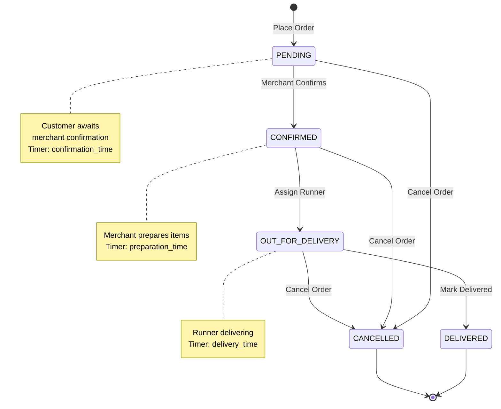
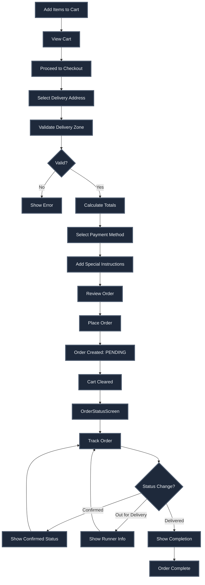
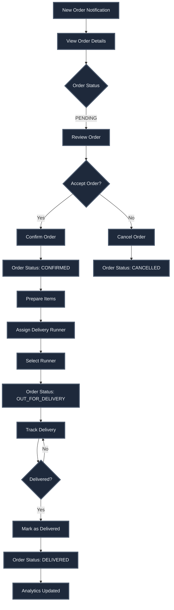

# Order Management System - Complete Documentation

## Overview

A comprehensive real-time order management system with automatic timing tracking, status updates, delivery runner assignment, and full order lifecycle management for both consumers and merchants.

## Order Lifecycle

### Order States



### State Details

#### 1. PENDING
- **Initial state** when order is placed
- Customer awaits merchant confirmation
- Timer starts: `confirmation_time_seconds`
- **Transitions to:**
  - `confirmed` (by merchant)
  - `cancelled` (by customer or merchant)

#### 2. CONFIRMED
- Merchant has accepted the order
- Merchant prepares items
- Timer starts: `preparation_time_seconds`
- **Transitions to:**
  - `out_for_delivery` (when runner assigned)
  - `cancelled` (by merchant only)

#### 3. OUT_FOR_DELIVERY
- Runner assigned and dispatched
- Order is being delivered
- Timer starts: `delivery_time_seconds`
- **Transitions to:**
  - `delivered` (by merchant or runner)
  - `cancelled` (by merchant - edge case)

#### 4. DELIVERED
- **Terminal state**
- Order successfully delivered
- Analytics updated (items sold count)
- No further transitions allowed

#### 5. CANCELLED
- **Terminal state**
- Order cancelled at any stage
- Timings preserved up to cancellation point
- No further transitions allowed

## Database Schema

### Orders Table

```sql
CREATE TABLE orders (
  id UUID PRIMARY KEY,
  order_number TEXT UNIQUE, -- Format: ORD-YYYYMMDD-NNNN
  shop_id UUID REFERENCES shops(id),
  user_id UUID REFERENCES auth.users(id),
  consumer_address_id UUID REFERENCES consumer_addresses(id),
  delivery_runner_id UUID REFERENCES delivery_runners(id),
  
  -- Status
  status order_status NOT NULL, -- pending, confirmed, out_for_delivery, delivered, cancelled
  
  -- Pricing (in cents)
  subtotal_cents INTEGER NOT NULL,
  delivery_fee_cents INTEGER NOT NULL,
  surcharge_cents INTEGER DEFAULT 0,
  total_cents INTEGER NOT NULL,
  
  -- Payment
  payment_method payment_method NOT NULL, -- cash, card, wallet
  special_instructions TEXT,
  
  -- Timestamps
  placed_at TIMESTAMPTZ NOT NULL,
  confirmed_at TIMESTAMPTZ,
  out_for_delivery_at TIMESTAMPTZ,
  delivered_at TIMESTAMPTZ,
  cancelled_at TIMESTAMPTZ,
  
  -- Calculated Durations (seconds)
  confirmation_time_seconds INTEGER,
  preparation_time_seconds INTEGER,
  delivery_time_seconds INTEGER,
  
  -- Cancellation
  cancellation_reason TEXT,
  cancelled_by UUID REFERENCES auth.users(id),
  
  -- Snapshots (preserved at order time)
  delivery_address JSONB NOT NULL,
  customer_name TEXT,
  customer_email TEXT,
  customer_phone TEXT,
  
  created_at TIMESTAMPTZ NOT NULL,
  updated_at TIMESTAMPTZ NOT NULL
);
```

### Order Items Table

```sql
CREATE TABLE order_items (
  id UUID PRIMARY KEY,
  order_id UUID REFERENCES orders(id) ON DELETE CASCADE,
  merchant_item_id UUID REFERENCES merchant_items(id),
  
  -- Snapshots (preserved at order time)
  item_name TEXT NOT NULL,
  item_description TEXT,
  item_image_url TEXT,
  item_price_cents INTEGER NOT NULL,
  
  quantity INTEGER NOT NULL CHECK (quantity > 0),
  subtotal_cents INTEGER NOT NULL,
  
  created_at TIMESTAMPTZ NOT NULL
);
```

## Order Flow Diagrams

### Consumer Order Flow



### Merchant Order Processing Flow



## Order Calculation

### Totals Calculation

```typescript
interface OrderCalculation {
  subtotal_cents: number;      // Sum of (item_price * quantity)
  delivery_fee_cents: number;   // Based on distance and delivery logic
  surcharge_cents: number;      // Small order surcharge (if applicable)
  total_cents: number;          // subtotal + delivery_fee + surcharge
  freeDeliveryApplied: boolean; // Whether free delivery threshold met
}
```

### Delivery Fee Calculation

**Factors:**
1. Distance from shop to delivery address
2. Delivery fee per kilometer
3. Free delivery threshold
4. Minimum order value
5. Small order surcharge

**Logic:**
```typescript
if (subtotal >= freeDeliveryThreshold) {
  deliveryFee = 0;
} else {
  distance = calculateDistance(shopLocation, deliveryAddress);
  deliveryFee = distance * feePerKm;
}

if (subtotal < minimumOrderValue) {
  surcharge = smallOrderSurcharge;
}
```

## Services

### Consumer Order Service

**File:** `src/services/consumer/orderService.ts`

**Key Functions:**

```typescript
// Calculate order totals
calculateOrderTotals(
  shopId: string,
  items: Array<{ merchant_item_id: string; quantity: number }>,
  addressId: string
): Promise<OrderCalculation>

// Place order
placeOrder(request: {
  shop_id: string;
  consumer_address_id: string;
  items: Array<{ merchant_item_id: string; quantity: number }>;
  payment_method: 'cash' | 'card' | 'wallet';
  special_instructions?: string;
}): Promise<PlaceOrderResponse>

// Get user orders
getUserOrders(): Promise<OrderWithAll[]>

// Get order by ID
getOrderById(orderId: string): Promise<OrderWithAll>

// Get active order
getActiveOrder(): Promise<OrderWithAll | null>

// Cancel order
cancelOrder(orderId: string, reason: string): Promise<{ success: boolean }>
```

### Merchant Order Service

**File:** `src/services/merchant/orderService.ts`

**Key Functions:**

```typescript
// Get shop orders
getShopOrders(shopId: string): Promise<OrderWithAll[]>

// Get filtered orders
getFilteredShopOrders(
  shopId: string,
  filters: OrderFilters
): Promise<OrderWithAll[]>

// Confirm order
confirmOrder(orderId: string): Promise<{ success: boolean }>

// Assign runner and dispatch
assignRunnerAndDispatch(
  orderId: string,
  runnerId: string
): Promise<{ success: boolean }>

// Mark as delivered
markOrderDelivered(orderId: string): Promise<{ success: boolean }>

// Cancel order
cancelOrder(orderId: string, reason: string): Promise<{ success: boolean }>

// Get analytics
getShopOrderAnalytics(
  shopId: string,
  period: 'today' | 'yesterday' | 'week' | 'month' | 'all'
): Promise<OrderAnalytics>
```

## Real-Time Updates

### Supabase Realtime Subscriptions

**Consumer Side:**
```typescript
// Subscribe to order changes
const { data: order } = useOrder(orderId);
// Automatically updates on status changes

// Subscribe to all user orders
const { data: orders } = useUserOrders();
// Refetches on any order change
```

**Merchant Side:**
```typescript
// Subscribe to shop orders
const { data: orders } = useShopOrders(shopId);
// Real-time updates for new orders and status changes
```

### Update Triggers

- Order status changes → Notify consumer and merchant
- Runner assignment → Update order and runner status
- Order completion → Update analytics

## Timing Tracking

### Automatic Timing Calculation

**Database Triggers:**
- `placed_at` → `confirmed_at` = `confirmation_time_seconds`
- `confirmed_at` → `out_for_delivery_at` = `preparation_time_seconds`
- `out_for_delivery_at` → `delivered_at` = `delivery_time_seconds`

**Real-Time Timers:**
- Live count-up timers for active orders
- Preserved timings for completed orders
- Handles app restarts (calculates from timestamps)

## Analytics

### Order Analytics

**Metrics Tracked:**
- Total orders (period-based)
- Total revenue
- Average order value
- Average confirmation time
- Average preparation time
- Average delivery time
- Status breakdown

### Item Analytics

**On Order Delivery:**
- Increments `times_sold` for each item
- Adds to `total_revenue_cents` for each item
- Executed atomically in database trigger

## Edge Cases Handled

1. **Minimum Order Value** - Enforced before order placement
2. **Delivery Zone Validation** - Prevents ordering from unavailable zones
3. **Price Snapshots** - Order items preserve prices at order time
4. **Simultaneous Orders** - Database-level locking prevents race conditions
5. **Order Cancellation** - Time-based rules and state validation
6. **Runner Assignment** - Handles busy runners with queuing
7. **Status Transitions** - Database constraints enforce valid transitions
8. **Terminal States** - Cannot modify delivered/cancelled orders
9. **Network Failures** - Graceful error handling and retry logic
10. **Concurrent Updates** - Optimistic locking and transactions

## Security

1. **Row Level Security** - Users can only access their own orders
2. **Shop Ownership** - Merchants can only access their shop orders
3. **Order Validation** - Server-side validation of all operations
4. **Data Snapshots** - Address and item snapshots prevent manipulation
5. **Status Transition Validation** - Database-level constraints

## Performance Optimizations

1. **Efficient Queries** - Indexed lookups on shop_id, user_id, status
2. **Real-Time Efficiency** - Targeted subscriptions per order/shop
3. **Caching** - React Query caching for order lists
4. **Pagination** - Cursor-based pagination for large lists
5. **Optimistic Updates** - Immediate UI feedback

## Integration Points

### With Cart System
- Cart cleared after successful order placement
- Cart validation before checkout

### With Delivery System
- Runner assignment triggers order status change
- Runner status updates on order completion

### With Inventory System
- Item sales tracking on delivery
- Revenue calculation per item

### With Consumer App
- Real-time order tracking
- Active order banner
- Order history

### With Merchant App
- Order notifications
- Order management UI
- Analytics dashboard

